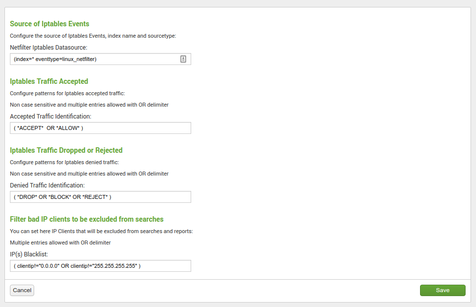
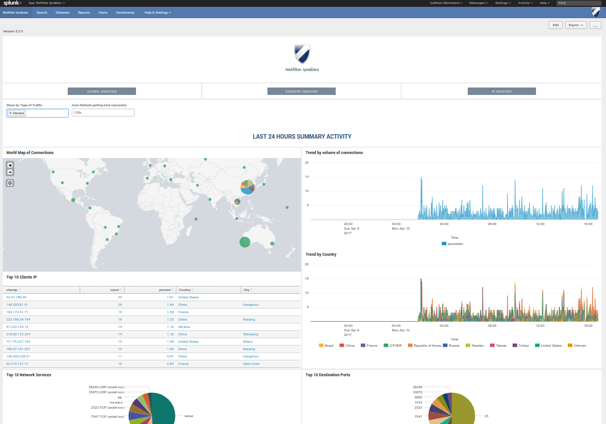

############################
Deployment and configuration
############################

The deployment of the application has to respect Splunk good practices depending on the topology of your deployment:

.. _deployment:

==========
Deployment
==========

The deployment of the application is very simple and relies on your Splunk installation:

-----------------
Standalone server
-----------------

- Download the application as a tgz archive from Splunk base: https://splunkbase.splunk.com/app/1353

- Use the application manager to install the application, or uncompress using CLI:

*example:*::

    cd /opt/splunk/etc/apps/
    tar -xvf <path to archive>

----------------------
Distributed deployment
----------------------

- If you are not using Search Head Clustering (SHC), deploy the application in every search head needed (same procedure than for standalone servers)

- If you are using an SHC, uncompress the content of the tgz archive in your SHC deployer node, and apply the SHC cluster bundle, refer to:

http://docs.splunk.com/Documentation/Splunk/latest/DistSearch/PropagateSHCconfigurationchanges

=============
Configuration
=============

-------------------------
Application configuration
-------------------------

After the installation and when you open the application, the setup screen of the application will automatically be displayed:

This screen allows you to:

- Configure the main macro that is used to retrieve your firewall events
- Configure the patterns that must be used to identify the accepted connections
- Configure the patterns that must be used to identity refused and dropped connections
- Blacklist specific IP addresses or host to avoid pollution

Recommendations:

- Once you have planned the name of the index(es) for your deployment, it is recommended for best performance to configure them in the screen above

---------------
Getting data in
---------------

**pre-requisites:**

You need to install the TA for iptables:

https://splunkbase.splunk.com/app/3089

Please review the documentation of the THA:

https://github.com/doksu/TA_netfilter/wiki

**Once you have deployed the TA:**

The TA documentation provides sample configuration for iptables, in addition of this documentation, you will find above some configuration examples.

""""""""""""""""""""
Ubuntu based servers
""""""""""""""""""""

1. Install ufw

Run::

    sudo apt-get install ufw

2. Configure ufw according to your needs, and activate logging

https://help.ubuntu.com/community/UFW

Activating the logging will enable logging dropped or refused packets::

    sudo ufw logging on

The activity of ufw is logged on the server in::

    /var/log/ufw.log

3. Make sure the Splunk instance can access this file with read permissions (you can use extended acl) and create a very basic and simple file monitor

*Example: (customize the name of the index according to your deloyment)*:

inputs.conf::

    [monitor:/var/log/ufw.log]
    index = security_firewall_os
    sourcetype = syslog

This inputs.conf can be configured in the TA local directory, or wherever you like.

"""""""""""""""""""""
Centos "like" servers
"""""""""""""""""""""

1. Configure iptables and activate logging

CentOS doc: https://wiki.centos.org/HowTos/Network/IPTables

*example configuration: /etc/sysconfig/iptables*::

    *filter
    :INPUT ACCEPT [0:0]
    :FORWARD ACCEPT [0:0]
    :OUTPUT ACCEPT [0:0]
    :LOGGING - [0:0]
    -A INPUT -i lo -j ACCEPT
    -A INPUT -m conntrack --ctstate RELATED,ESTABLISHED -j ACCEPT
    -A INPUT -p tcp -m tcp --dport 22 -m conntrack --ctstate NEW,ESTABLISHED -j ACCEPT
    -A INPUT -j LOGGING
    -A OUTPUT -o lo -j ACCEPT
    -A OUTPUT -m conntrack --ctstate ESTABLISHED -j ACCEPT
    -A LOGGING -m limit --limit 2/min -j LOG --log-prefix "iptables: DROP: " --log-level 7
    -A LOGGING -j DROP
    COMMIT

2. Configure rsyslog to log iptables events in a separated log file

*example configuration: /etc/rsyslog.d/iptables.conf*::

    :msg, contains, "iptables:" -/var/log/iptables.log
    & ~

Restart rsyslog::

    service rsyslog restart

3. Configure logrotate.d

*example configuration: /etc/logrotate.d/iptables*::

    /var/log/iptables.log
    {
            rotate 7
            daily
            missingok
            notifempty
            delaycompress
            compress
            create 0664 root root
            postrotate
                    invoke-rc.d rsyslog rotate > /dev/null
            endscript
    }

4. Make sure the Splunk instance can access this file with read permissions (you can use extended acl) and create a very basic and simple file monitor

*Example: (customize the name of the index according to your deloyment)*:

inputs.conf::

    [monitor:/var/log/iptables.log]
    index = security_firewall_os
    sourcetype = syslog

Ensure Splunk is restarted after the deployment of this inputs.conf, et voila!

