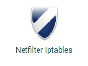
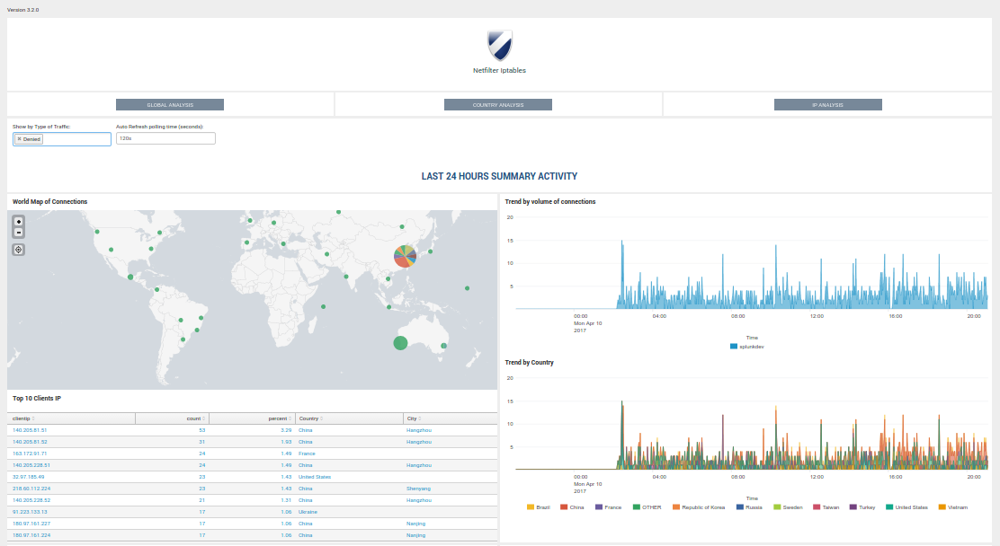

.. Netfilter Iptables for Splunk documentation master file, created by
   sphinx-quickstart on Fri Apr  7 16:36:54 2017.
   You can adapt this file completely to your liking, but it should at least
   contain the root `toctree` directive.

Welcome to Netfilter Iptables for Splunk's documentation!
=========================================================

Contents:

Overview:
---------

.. toctree::
   :maxdepth: 2

   about
   releasenotes
   knownissues
   support
   openissue
   requirements
   download
   deployment_matrix

Installation and configuration:
-------------------------------

.. toctree::
   :maxdepth: 2

   deployment
   upgrade
